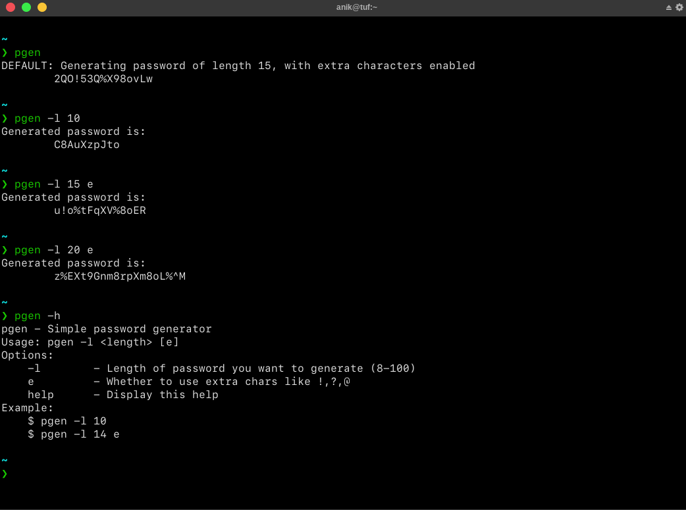

# pgen - Simple Password Generator CLI written in C++


## Requirements: 
- `gcc/g++`
- `make`
- `~/.local/bin` in your PATH environment variable

## Steps:
```bash
$ sudo apt-get install gcc make

$ git clone https://github.com/sadn1ck/pgen

$ cd pgen

$ mkdir -p ~/.local/bin/

$ vim ~/.bashrc

# Add this line to your bashrc or zshrc
# $USER = your username
# export PATH=/home/$USER/.local/bin:$PATH
# Change YOURUSERNAME with your user

$ source ~/.bashrc

# To build the binary from the source files
$ make build

# To copy built binary to the above directory so that it is available everywhere
$ make install

# To clean files and build while developing
$ make # or make all
```

## WIP
- [ ] Tests
- [x] Docs 
- [x] Separation into proper header files

